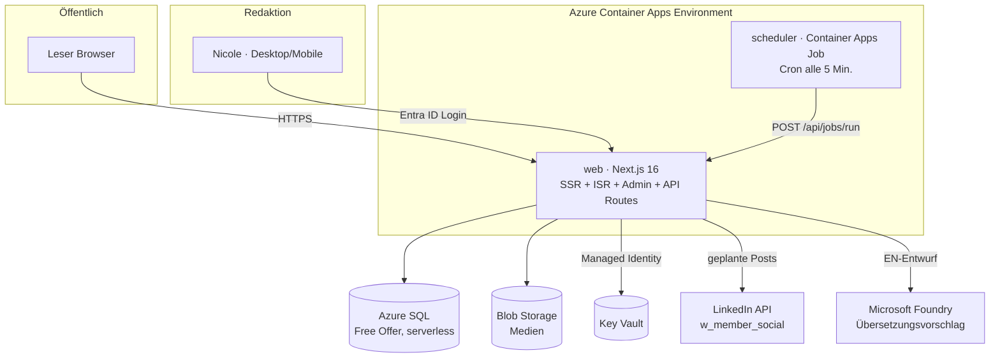
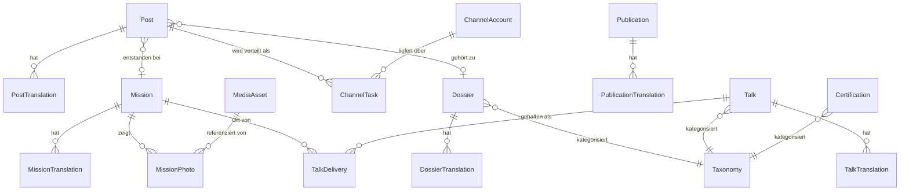
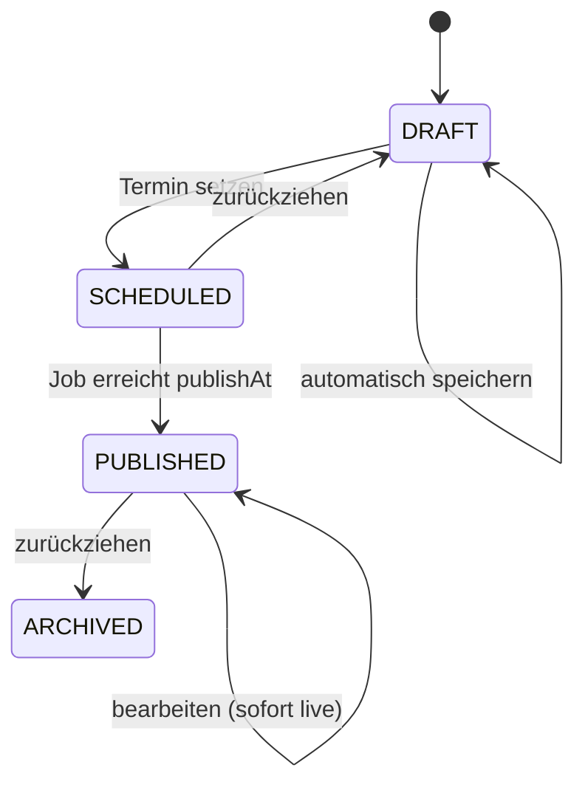
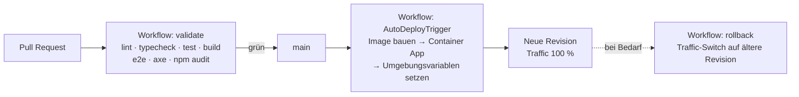

# nicolenders.com — Spezifikation

**Projekt:** Persönliche Website und Publikationsplattform von Nicole Enders („Die Agentin")
**Domain:** nicolenders.com
**Stand:** 01.08.2026
**Adressat dieses Dokuments:** Claude Code

---

## 0. Ziel in drei Sätzen

Eine zweisprachige (DE/EN) Website, auf der eine einzelne Person Inhalte schnell erfasst, terminiert veröffentlicht und optional automatisch auf LinkedIn spiegelt. Kernbereiche: kurze Beiträge und geteilte Links, langlebige Wissensseiten, ein Reiseblog über Vortragsreisen mit Weltkarte, ein Vortragskatalog mit Auswertung sowie Publikationen und Zertifizierungen. Betrieb auf Azure mit möglichst geringen laufenden Kosten, WCAG 2.1 AA als Qualitätsziel, Deployment über GitHub Actions.

**Nicht-Ziele (v1):** Mehrbenutzerfähigkeit, Kommentarfunktion, Newsletter-Versand, Volltextsuche über alles, E-Commerce, Analytics mit Personenbezug.

---

## 1. Getroffene Entscheidungen

| Thema | Entscheidung | Begründung |
|---|---|---|
| Stack | Next.js 16 (App Router) + TypeScript, ein Deployable | Eine Person wartet das System. Zwei Runtimes = zwei Update-Zyklen, zwei Build-Stages, Auth über Systemgrenzen. Editor und Renderer teilen sich dieselben Typen. |
| Styling | SCSS + CSS Modules, Design-Tokens als CSS Custom Properties | Kein Utility-Framework als Abhängigkeit; Tokens direkt aus dem Banner ableitbar |
| ORM/DB | Prisma + Azure SQL Database (Free Offer) | Relationale Auswertungen (Vortrags-Ranking mit Zeitraum, Missionen ↔ Talks) sind der Kern; Free Offer deckt das Volumen dauerhaft ab |
| Hosting | Azure Container Apps (Consumption) | Scale-to-Zero-fähig, Cron-Jobs im selben Dienst, kein Preview-Feature nötig |
| Auth | Auth.js v5, Provider Microsoft Entra ID, JWT-Session, Allow-List auf Object ID | Genau ein Admin. Keine User-Tabelle, keine Passwörter, keine Registrierung. |
| Editor | TipTap 3, Inhalt als JSON in der DB | Mobil bedienbar, erweiterbar um eigene Node-Typen (Marginalbild, Galerie, Video), sicherer als HTML-Speicherung |
| Karte | d3-geo + gebündeltes world-atlas TopoJSON, gerendert als SVG | Keine Tile-Provider, keine Drittanbieter-Requests, keine Kosten, kein Consent nötig |
| Social | LinkedIn automatisch, übrige Kanäle als Ein-Klick-Aufgabe | X kostet pro Link-Post; Meta erfordert App Review; YouTube-Community-Posts sind nicht offen per API bespielbar |
| i18n | DE ist Quellsprache, EN wird als KI-Rohübersetzung vorgeschlagen | Beitrag ist auch ohne EN veröffentlichbar |

### 1.1 Warum nicht Azure Static Web Apps

SWA scheidet aus zwei Gründen aus: <cite index="70-1">Managed Functions unterstützen dort ausschließlich HTTP-Trigger, für zeitgesteuerte Jobs ist eine separate Functions-App nötig</cite>, und die Next.js-Hybrid-Unterstützung <cite index="72-1">befindet sich weiterhin in der Preview und schließt verknüpfte APIs über Azure Functions, App Service, Container Apps oder API Management aus</cite>. Beides zusammen würde die Architektur auf zwei Dienste aufteilen, ohne Gegenwert.

---

## 2. Architektur



**Warum ein Job-Container und kein Timer im Web-Container:** Container Apps skaliert die Web-Revision auf null; ein In-Process-Timer würde dabei sterben. Der Job läuft unabhängig, ruft einen internen Endpunkt mit Shared Secret auf und weckt die Web-Instanz.

### 2.1 Caching-Strategie (kritisch)

Die Azure-SQL-Datenbank im Free Offer pausiert bei Inaktivität. Ein Leser darf davon nichts merken. Deshalb:

- Alle öffentlichen Seiten werden statisch generiert bzw. per ISR gecacht und mit Cache-Tags versehen (`post:<id>`, `mission:<id>`, `list:signals:<locale>` …).
- Ein normaler Seitenaufruf berührt die Datenbank **nicht**.
- Beim Veröffentlichen invalidiert der Publish-Vorgang gezielt die betroffenen Tags.
- Nur Admin-Routen und der Publish-Job sprechen die DB direkt an. Ein Kaltstart von 30–60 Sekunden ist dort akzeptabel; die Admin-Oberfläche zeigt in dem Fall einen „Datenbank wird geweckt"-Zustand statt eines Timeouts.
- DB-Client mit erhöhtem `connect_timeout` (60 s) und einem Retry für den ersten Verbindungsversuch.

---

## 3. Datenmodell



### 3.1 Prisma-Schema (Ausgangspunkt, vollständig auszubauen)

```prisma
datasource db { provider = "sqlserver"; url = env("DATABASE_URL") }
generator client { provider = "prisma-client-js" }

enum Locale        { de en }
enum PostType      { SIGNAL NOTE BACKSTAGE }        // geteilter Link | Kurzmeldung | hinter den Kulissen
enum ContentStatus { DRAFT SCHEDULED PUBLISHED ARCHIVED }
enum TransState    { MISSING AI_DRAFT REVIEWED }
enum MissionStatus { PLANNED DONE CANCELLED }
enum Platform      { LINKEDIN X INSTAGRAM FACEBOOK YOUTUBE }
enum TaskState     { PENDING SENT FAILED MANUAL_OPEN MANUAL_DONE SKIPPED }
enum TaxonomyKind  { DOSSIER TALK CERTIFICATION }

model Post {
  id           String        @id @default(cuid())
  type         PostType
  status       ContentStatus @default(DRAFT)
  publishAt    DateTime?                    // geplanter Zeitpunkt, UTC
  publishedAt  DateTime?
  // nur bei type = SIGNAL:
  sourceUrl    String?       @db.NVarChar(2048)
  sourceTitle  String?
  sourceSite   String?
  sourceImage  String?
  heroAssetId  String?
  missionId    String?
  dossierId    String?
  createdAt    DateTime      @default(now())
  updatedAt    DateTime      @updatedAt
  translations PostTranslation[]
  tasks        ChannelTask[]
  tags         PostTag[]
  @@index([status, publishAt])
}

model PostTranslation {
  id         String     @id @default(cuid())
  postId     String
  locale     Locale
  slug       String                              // eindeutig je locale
  title      String
  summary    String?    @db.NVarChar(600)        // für Karten, Feed, OpenGraph
  bodyJson   String     @db.NVarChar(Max)        // TipTap-Dokument
  socialText String?    @db.NVarChar(2000)
  state      TransState @default(MISSING)
  post       Post       @relation(fields: [postId], references: [id], onDelete: Cascade)
  @@unique([postId, locale])
  @@unique([locale, slug])
}

model Dossier {
  id           String        @id @default(cuid())
  status       ContentStatus @default(DRAFT)
  publishAt    DateTime?
  categoryId   String?
  reviewedAt   DateTime?                         // „zuletzt geprüft am" – öffentlich sichtbar
  translations DossierTranslation[]
}
// DossierTranslation analog zu PostTranslation (+ tocEnabled)

model Mission {
  id           String        @id @default(cuid())
  eventName    String
  city         String
  countryCode  String        @db.Char(2)
  lat          Float
  lon          Float
  startDate    DateTime
  endDate      DateTime?
  status       MissionStatus @default(PLANNED)
  eventUrl     String?       @db.NVarChar(2048)
  contentStatus ContentStatus @default(DRAFT)
  translations MissionTranslation[]
  photos       MissionPhoto[]
  deliveries   TalkDelivery[]
  @@index([startDate])
}

model MissionTranslation {
  id        String @id @default(cuid())
  missionId String
  locale    Locale
  slug      String
  eventText String @db.NVarChar(Max)   // Bereich 1: die Veranstaltung
  talkText  String @db.NVarChar(Max)   // Bereich 2: mein Vortrag
  state     TransState @default(MISSING)
  @@unique([missionId, locale])
}

model Talk {
  id           String  @id @default(cuid())
  categoryId   String
  level        String?                  // "100" | "200" | "300" | "400"
  durationMin  Int?
  active       Boolean @default(true)
  translations TalkTranslation[]        // Titel + Abstract je Sprache
  deliveries   TalkDelivery[]
}

model TalkDelivery {                    // ein tatsächlich gehaltener Vortrag
  id        String   @id @default(cuid())
  talkId    String
  missionId String
  language  Locale                       // Sprache, in der gehalten wurde
  heldOn    DateTime
  @@index([heldOn])
  @@index([talkId, language])
}

model MediaAsset {
  id        String  @id @default(cuid())
  blobPath  String                        // Original
  width     Int
  height    Int
  mime      String
  altDe     String                        // Pflicht
  altEn     String?
  credit    String?
  variants  String  @db.NVarChar(Max)     // JSON: [{w,format,path}]
  createdAt DateTime @default(now())
}

model ChannelAccount {
  platform     Platform @id
  displayName  String
  connected    Boolean  @default(false)
  tokenRef     String?                    // Key-Vault-Secret-Name, nie das Token selbst
  expiresAt    DateTime?
  lastError    String?
}

model ChannelTask {
  id         String    @id @default(cuid())
  postId     String
  platform   Platform
  state      TaskState @default(PENDING)
  scheduledAt DateTime
  sentAt     DateTime?
  remoteUrl  String?
  attempts   Int       @default(0)
  lastError  String?
  payload    String    @db.NVarChar(Max)  // vorbereiteter Text + Asset-Referenz
  @@index([state, scheduledAt])
}

model AuditLog {
  id        String   @id @default(cuid())
  at        DateTime @default(now())
  actor     String
  action    String
  entity    String
  entityId  String
  detail    String?  @db.NVarChar(Max)
}
```

Weiter zu modellieren, analog: `Publication` + `PublicationTranslation` (Typ: BOOK | ARTICLE | WHITEPAPER, ISBN, Verlag, Jahr, Cover-Asset, Link), `Certification` (Name, Kürzel, Kategorie, erworben, gültig bis, Nachweis-URL, Reihe für Mehrfachauszeichnungen wie MVP 2020–2026), `Taxonomy` (kind, nameDe, nameEn, slug, sortOrder), `Tag` + `PostTag`.

### 3.2 Risiko: Prisma und Entra-ID-Authentifizierung gegen Azure SQL

Ziel ist Managed Identity ohne Passwort. Ob der Prisma-SQL-Server-Connector Token-Authentifizierung in der benötigten Form unterstützt, ist **vor** M1 praktisch zu verifizieren. Fällt der Test negativ aus: SQL-Authentifizierung mit einem Passwort, das ausschließlich im Key Vault liegt und per Container-Apps-Secret-Referenz eingebunden wird. Diese Entscheidung ist in `docs/decisions/0002-db-auth.md` festzuhalten.

---

## 4. Inhaltsmodell und Bausteine

Der Editor speichert ein TipTap-JSON-Dokument. Erlaubte Node-Typen — alles andere wird beim Speichern verworfen:

| Node | Attribute | Verfügbar in |
|---|---|---|
| `paragraph` | `marginAsset` (`assetId`, `side: left \| right`, `caption`) | Beitrag, Dossier, Mission |
| `heading` | `level: 2 \| 3` | alle |
| `bulletList`, `orderedList`, `listItem` | — | alle |
| `blockquote` | — | alle |
| `codeBlock` | `language` | alle |
| `table` | Kopfzeile ja/nein | alle |
| `image` | `assetId`, `caption`, `full \| left \| right` | alle |
| `gallery` | `assetIds[]`, `caption` | nur Dossier, Mission |
| `video` | `provider: youtube`, `videoId`, `title` | nur Dossier |
| `videoGallery` | `videos[]` | nur Dossier |
| `linkCard` | `url`, `title`, `site`, `image` | Beitrag (Typ SIGNAL) |
| `toc` | — | nur Dossier |
| `divider` | — | alle |

Marks: `bold`, `italic`, `underline`, `strike`, `code`, `link` (`rel="noopener"`, externe Links markiert).

**Rendering:** eigener Renderer `renderDocument(doc, locale)`, der Node-Typen auf React-Server-Components abbildet. Kein `dangerouslySetInnerHTML` auf gespeicherten Inhalten. Das Marginalbild wird als CSS-Grid gesetzt und fällt unter 900 px Breite auf volle Breite über dem Absatz zurück.

---

## 5. Informationsarchitektur und Routing

Alle öffentlichen Routen liegen unter `/[locale]`, `de` ist Standard und wird nicht weggekürzt (`/de/...`, `/en/...`, `/` leitet auf `/de` um; `Accept-Language` nur beim ersten Besuch berücksichtigen, danach Cookie-frei über den Pfad).

| Route | Inhalt |
|---|---|
| `/[locale]` | HQ: Hero, Statusleiste, letzte Signale, Zähler, nächster Einsatz |
| `/[locale]/signale` | Feed aller Beiträge, Filter nach Typ und Thema, Pagination |
| `/[locale]/signale/[slug]` | Beitragsdetail |
| `/[locale]/dossiers` | Übersicht nach Kategorie |
| `/[locale]/dossiers/[slug]` | Dossier mit TOC, Galerie, Video |
| `/[locale]/einsaetze` | Weltkarte, Jahresfilter, Liste als Tabelle |
| `/[locale]/einsaetze/[slug]` | Einsatzakte: Veranstaltung, Briefing, Fotos |
| `/[locale]/briefings` | Vortragskatalog nach Kategorie, Sprachverfügbarkeit |
| `/[locale]/briefings/[slug]` | Vortragsdetail, wo und in welcher Sprache gehalten |
| `/[locale]/publikationen` | Bücher und weitere Veröffentlichungen |
| `/[locale]/ausbildung` | Zertifizierungen nach Kategorie |
| `/[locale]/legende` | Über mich, Mission, Säulen, Kontakt |
| `/[locale]/impressum`, `/datenschutz`, `/barrierefreiheit` | Rechtstexte |
| `/feed.xml`, `/feed.en.xml`, `/sitemap.xml`, `/robots.txt` | Maschinenlesbares |
| `/admin/**` | Redaktion, komplett `noindex`, nur mit Rolle Admin |

**Slugs** werden je Sprache gepflegt und beim ersten Veröffentlichen eingefroren. Eine pflegbare Weiterleitungstabelle gibt es nicht mehr (ADR 0024): Wo eine Adresse einmal umziehen muss, steht die Regel im Code (`lib/seo/legacy-redirects.ts`, `next.config.ts`) und muss von niemandem nachgetragen werden.

---

## 6. Redaktionsworkflow



**Regeln:**
- Jeder Inhalt startet als Entwurf, wird alle 5 Sekunden lokal und alle 30 Sekunden serverseitig gespeichert.
- `publishAt` wird in UTC gespeichert, in der Oberfläche in `Europe/Berlin` angezeigt und bearbeitet.
- Veröffentlichung darf nur passieren, wenn die Prüfliste grün ist: Titel, Summary, alle Bilder mit Alt-Text, mindestens die DE-Fassung vorhanden.
- Der Job läuft alle 5 Minuten und verarbeitet alles mit `status = SCHEDULED AND publishAt <= now()`. Er ist idempotent: doppelte Ausführung darf nichts zweimal senden (Transaktion + `state`-Prüfung).
- Nach dem Veröffentlichen: Cache-Tags invalidieren, `ChannelTask`s einreihen, `AuditLog` schreiben.

**Vorschau als Leser:** Der Editor rendert dieselben Komponenten wie die öffentliche Seite, in einem Container mit `preview`-Kennzeichnung, umschaltbar zwischen Desktop/Tablet/Smartphone und zwischen DE/EN. Zusätzlich eine teilbare Vorschau-URL `/preview/[token]` mit signiertem, 7 Tage gültigem Token — nützlich, um Veranstaltern vorab etwas zu zeigen.

---

## 7. Social Publishing

### 7.1 LinkedIn — automatisch

<cite index="27-1">„Share on LinkedIn" mit dem Scope `w_member_social` ist ohne Partnerantrag selbst freischaltbar und erlaubt das Posten im Namen des authentifizierten Mitglieds.</cite> Ablauf:

1. Einmalige Autorisierung in `/admin/kanaele` (OAuth 2.0, Authorization Code Flow).
2. Access Token und Refresh Token verschlüsselt im Key Vault, in der DB nur die Referenz und das Ablaufdatum.
3. Beim Veröffentlichen: `ChannelTask` mit vorbereitetem Text, Link und optionalem Bild → `POST /rest/posts`.
4. Fehlerbehandlung: drei Versuche mit exponentiellem Backoff, danach `FAILED` mit sichtbarer Meldung im Dashboard.
5. **Ablaufwarnung:** Access Tokens sind kurzlebig. Das Dashboard warnt 14 Tage vor Ablauf; ohne gültige Verbindung fallen geplante LinkedIn-Tasks automatisch auf `MANUAL_OPEN` zurück, statt zu scheitern.

Der Beitrag selbst geht in den Kommentar-freien Post-Body; Erwähnungen von Veranstaltern bleiben bewusst außen vor (die setzt Nicole manuell im ersten Kommentar).

### 7.2 X, Instagram, Facebook, YouTube — Ein-Klick-Freigabe

Kein API-Zwang, kein App Review, keine laufenden Kosten. Beim Veröffentlichen entsteht je aktiviertem Kanal eine Aufgabe im Zustand `MANUAL_OPEN`. In `/admin/kanaele` und auf dem Smartphone gibt es dafür eine Karte mit:

- fertigem Text (kanalspezifische Länge, Instagram mit Bild-Pflichtprüfung),
- Button **Text kopieren**,
- Button **Teilen** über die Web Share API (`navigator.share` mit Text, URL und Datei) — damit landet der Beitrag mit zwei Taps in der jeweiligen App,
- Button **Erledigt** setzt `MANUAL_DONE`.

Begründung für diesen Weg statt Vollautomatik: <cite index="39-1">X rechnet seit Februar 2026 pro Aufruf ab; ein Post mit Link kostet 0,20 USD</cite>, und <cite index="41-1">Instagram-Publishing verlangt ein Business- oder Creator-Konto, eine verknüpfte Facebook-Seite, eine Meta-App und ein App Review</cite>. Der Aufwand steht in keinem Verhältnis zu wenigen Posts pro Woche. Die Architektur hält den Weg offen: `ChannelTask` und `ChannelAccount` sind bereits plattformneutral, ein späterer echter Connector ersetzt nur den Versandadapter.

**YouTube:** kein Posting-Connector. Stattdessen dient der Kanal als Videoarchiv — Vortragsmitschnitte werden über den `video`-Baustein in Dossiers und Einsatzakten eingebettet. Vorschlag für die leere Kanalstruktur: Playlists je Briefing-Kategorie, ein „Backstage"-Format mit kurzen Clips aus der Vorbereitung, und Aufzeichnungen von Sessions, deren Rechte bei den Veranstaltern eingeholt wurden.

---

## 8. Zweisprachigkeit

- DE ist Quellsprache. EN ist optional.
- Fehlt EN, zeigt die englische Seite den deutschen Inhalt mit einem sichtbaren Hinweis („This article is only available in German") und korrektem `lang`-Attribut auf dem Inhaltsblock. Kein stiller Fallback.
- Der Editor bietet **EN-Rohübersetzung vorschlagen**: sendet `bodyJson` blockweise an ein Chat-Modell in Microsoft Foundry (Modell und Endpunkt konfigurierbar), erhält übersetzte Blöcke zurück, setzt `state = AI_DRAFT`.
- Ein `AI_DRAFT` ist im Admin deutlich markiert und **nicht** automatisch veröffentlichbar — erst nach Bestätigung wird daraus `REVIEWED`.
- Fachbegriffe bleiben unübersetzt: Der Übersetzungsprompt enthält eine Glossarliste (`config/glossary.json`) mit Begriffen wie Copilot Studio, Microsoft Foundry, Sensitivity Labels, Tenant, Agent, Prompt.
- Nicht übersetzt werden: Vortragstitel aus eingereichten Sessions (die bleiben, wie eingereicht), Produktnamen, Eigennamen.
- `hreflang`-Verweise zwischen den Sprachfassungen, `x-default` auf DE.

---

## 9. Rollen und Authentifizierung

| Rolle | Zugriff |
|---|---|
| Leser (anonym) | alle veröffentlichten Inhalte, kein Login, keine Registrierung |
| Admin/Editor | `/admin/**`, alle Schreiboperationen |

- Auth.js v5 mit `MicrosoftEntraID`-Provider, Session als JWT im httpOnly-Cookie, `SameSite=Lax`, `Secure`.
- Autorisierung über eine Allow-List von Entra Object IDs (`ADMIN_OBJECT_IDS`, kommasepariert). Ist die ID nicht enthalten → 403, kein Konto wird angelegt.
- MFA wird in Entra erzwungen, nicht in der Anwendung.
- Alle Schreiboperationen laufen über Server Actions mit Rollenprüfung **serverseitig** — die Sichtbarkeit von UI-Elementen ist keine Autorisierung.
- Rate Limiting auf Login- und Upload-Routen.

---

## 10. Design-System

Übernommen aus dem Banner, vollständig in `styles/_tokens.scss` als CSS Custom Properties:

```scss
--ink:            #05010D;  // Seitenhintergrund
--ink-2:          #0B0518;  // Flächen
--ink-3:          #120A24;  // Eingabefelder
--line:           #2A1A4A;
--violet:         #8B5CF6;
--violet-bright:  #A855F7;
--violet-text:    #C4A2FC;  // violetter Text auf dunklem Grund (kontrastgeprüft)
--magenta:        #E879F9;
--signal:         #38BDF8;
--ok:             #4ADE80;
--warn:           #FBBF24;
--text:           #EDE9F8;
--muted:          #A093C0;
```

- **Display:** Poppins (600/800), gesperrt für Versalien-Labels. **Fließtext:** Inter. **Daten und Metazeilen:** JetBrains Mono. Fonts self-hosted über `next/font/local` — keine Requests an Google-Server (Datenschutz und Ladezeit).
- **Signature-Element:** Zielmarken-Ecken an Karten (zwei L-Winkel aus 1 px Linien) plus Mono-Metazeile. Sparsam einsetzen; nicht auf jedem Element.
- **Sprachbild:** Missionen, Einsätze, Dossiers, Briefings, Signale, Legende, HQ. Die Metapher trägt die Navigation, ersetzt aber nie die Verständlichkeit: jeder Bereich hat im `<title>` und in der Meta Description eine klare Beschreibung.
- **Motion:** ein Puls auf dem Statuspunkt, ein Ping auf aktiven Kartenpins, Hover-Anhebung auf Karten. Mehr nicht. Alles hinter `prefers-reduced-motion`.
- Referenz-Umsetzung: `mockup-leseransicht.html` und `mockup-adminansicht.html` im Ordner `docs/mockups/`.

---

## 11. Barrierefreiheit (WCAG 2.1 AA)

Verbindliche Anforderungen:

- Kontrast: Fließtext ≥ 4,5:1, große Schrift und UI-Elemente ≥ 3:1. `--muted` auf `--ink` ist geprüft; violetter Text nur in `--violet-text` oder heller.
- Fokus sichtbar auf allen interaktiven Elementen, `:focus-visible` mit 2 px Magenta-Ring und Offset.
- Skip-Link „Zum Inhalt springen" als erstes fokussierbares Element.
- Vollständige Tastaturbedienung, auch im Editor (TipTap-Shortcuts dokumentiert unter `/admin/hilfe`).
- Alt-Texte sind **Pflichtfelder** beim Upload; ohne Alt-Text lässt sich der Beitrag nicht veröffentlichen. Dekorative Bilder ausdrücklich als solche markierbar (`alt=""`).
- Galerien: `role="region"` mit Label, horizontal per Pfeiltasten scrollbar, sichtbare Vor/Zurück-Schalter (nicht nur Wischgeste).
- **Karte:** Eine interaktive SVG-Karte ist für Screenreader-Nutzung nicht sinnvoll erschließbar. Deshalb ist die vollständige Einsatzliste als Tabelle unter der Karte **immer** sichtbar — nicht ausgeklappt, nicht versteckt. Jeder Pin ist zusätzlich fokussierbar mit `aria-label` „Veranstaltung, Ort, Datum" und per Enter aktivierbar. Das ist die ehrliche Umsetzungsgrenze: die Karte ist Beiwerk, die Tabelle ist der Inhalt.
- Videos: YouTube-Untertitel aktivieren, wo vorhanden; bei eigenen Aufzeichnungen Transkript verlinken.
- `lang`-Attribut je Sprachfassung, auch bei Fallback-Inhalten auf Blockebene.
- Zielgröße für Tippflächen mindestens 44 × 44 px in der mobilen Redaktionsansicht.
- Automatisierte Prüfung in CI mit `axe-core` über die Hauptrouten; manuelle Prüfung mit Tastatur und NVDA vor jedem Release.

---

## 12. Rechtliche Pflichtseiten

### 12.1 Impressum

Rechtsgrundlage ist <cite index="20-1">§ 5 DDG, der verlangt, dass die Angaben leicht erkennbar, unmittelbar erreichbar und ständig verfügbar sind</cite>; <cite index="18-1">das DDG hat am 14. Mai 2024 das Telemediengesetz abgelöst, die Pflichtangaben sind weitgehend deckungsgleich mit dem früheren § 5 TMG</cite>. Aus jeder Unterseite in maximal zwei Klicks erreichbar → Footer-Link auf allen Seiten.

Pflichtfelder im CMS (`/admin/einstellungen/impressum`), alle als Klartext gepflegt:

- Name und ladungsfähige Anschrift (Postfach genügt nicht)
- E-Mail-Adresse — **verpflichtend**, auch wenn LinkedIn der bevorzugte Weg ist
- Telefonnummer oder ein zweiter Weg zur unmittelbaren Kommunikation
- Umsatzsteuer-Identifikationsnummer, falls vorhanden
- Verantwortliche für redaktionelle Inhalte nach § 18 Abs. 2 MStV, mit Name und Anschrift — greift, weil die Website journalistisch-redaktionelle Beiträge enthält
- Hinweis zur EU-Streitschlichtungsplattform, falls einschlägig

Der LinkedIn-Kontakt wird prominent als bevorzugter Weg dargestellt, ersetzt die Pflichtangaben aber nicht.

### 12.2 Datenschutzerklärung

Inhalte: Verantwortliche, Hosting (Azure, Region Germany West Central oder West Europe — Region im Text nennen), Server-Logs mit Zweck und Löschfrist, keine Analyse-Cookies, eingebettete YouTube-Videos mit Zwei-Klick-Lösung, Kontaktaufnahme über LinkedIn mit Verweis auf deren Datenschutzhinweise, Rechte der Betroffenen, Beschwerderecht bei der Aufsichtsbehörde.

**Cookies:** Die Website setzt technisch notwendige Cookies ausschließlich für den Admin-Login. Damit ist kein Consent-Banner für Leser nötig. Consent wird punktuell nur dort abgefragt, wo ein YouTube-Video eingebettet ist — als Overlay auf dem jeweiligen Video, nicht als seitenweites Banner. Das ist die datenschutzfreundlichste und für Leser angenehmste Variante.

### 12.3 Erklärung zur Barrierefreiheit

Rechtlich vermutlich nicht erforderlich: <cite index="11-1">Kleinstunternehmen mit weniger als zehn Beschäftigten und höchstens zwei Millionen Euro Jahresumsatz oder Bilanzsumme sind als Dienstleistungserbringer vom BFSG ausgenommen</cite>, und <cite index="15-1">redaktionelle Bereiche wie Blogs oder Magazine sind in der Regel nicht erfasst, solange sie nicht auf einen Vertragsschluss abzielen</cite>. Die Erklärung wird trotzdem veröffentlicht: Stand der Konformität, bekannte Einschränkungen (Karte), Rückmeldeweg. Das ist eine Positionierung, keine Pflichtübung.

**Hinweis für die Umsetzung:** Alle drei Texte sind vor der Veröffentlichung juristisch zu prüfen. Claude Code erzeugt Struktur, Felder und Platzhalter, aber keinen fertigen Rechtstext.

---

## 13. Sicherheit

- **Secrets:** ausschließlich Key Vault, eingebunden über Container-Apps-Secret-Referenzen mit User-Assigned Managed Identity. Keine Secrets in Repository, Pipeline-Variablen oder Container-Images.
- **Content Security Policy** mit Nonce, ohne `unsafe-inline`. Erlaubte externe Quellen: `www.youtube-nocookie.com` (nur nach Consent), Blob-Storage-Domain für Bilder. Alles andere `'self'`.
- Weitere Header: `Strict-Transport-Security` (2 Jahre, preload), `X-Content-Type-Options: nosniff`, `Referrer-Policy: strict-origin-when-cross-origin`, `Permissions-Policy` mit deaktivierter Kamera, Mikrofon, Geolocation.
- **Uploads:** Nur `image/jpeg|png|webp|avif`, Magic-Byte-Prüfung statt Dateiendung, Größenlimit 20 MB, Metadaten (EXIF/GPS) beim Verarbeiten entfernen — Standortdaten aus Konferenzfotos gehören nicht ins Netz.
- **Link-Vorschau (SIGNAL):** Der Abruf fremder URLs ist ein SSRF-Risiko. Nur `https`, keine privaten IP-Bereiche, Redirect-Limit 3, Timeout 5 Sekunden, Antwortgröße begrenzt.
- Ausgehende Aufrufe an LinkedIn und Foundry über Allow-List.
- Prisma-Parameterbindung überall; keine String-Konkatenation in Queries.
- Abhängigkeiten: Dependabot im GitHub-Repo, `npm audit` als Pipeline-Gate, Next.js auf Active LTS halten — <cite index="82-1">die Angriffsfläche ist mit Middleware, Image Optimization, Server Actions und React Server Components gewachsen, und CVE-Cluster treffen jeweils alle noch verbreiteten Versionen</cite>.
- Admin-Bereich mit `X-Robots-Tag: noindex, nofollow`.

---

## 14. Azure-Infrastruktur

Alles als Bicep unter `infra/`, ein Deployment pro Umgebung.

| Ressource | SKU / Konfiguration | Kosten |
|---|---|---|
| Container Apps Environment | Consumption, Workload Profile „Consumption" | Umgebung selbst kostenfrei |
| Container App `web` | 0,25 vCPU / 0,5 GiB, min 1 / max 3 Replicas | <cite index="57-1">Die ersten 180.000 vCPU-Sekunden, 360.000 GiB-Sekunden und 2 Mio. HTTP-Requests pro Monat und Subscription sind frei</cite>; darüber Idle-Rate → ca. 4–8 €/Monat |
| Container Apps Job `scheduler` | Cron `*/5 * * * *`, 0,25 vCPU | innerhalb des Frei-Kontingents |
| Azure SQL Database | Free Offer, General Purpose Serverless | <cite index="62-1">100.000 vCore-Sekunden, 32 GB Daten und 32 GB Backup pro Datenbank und Monat, dauerhaft</cite> → 0 € |
| Storage Account | Standard LRS, Container `media` (öffentlich lesend), `uploads` (privat) | < 1 €/Monat |
| Key Vault | Standard | < 1 €/Monat |
| Container Registry | Basic | ca. 5 €/Monat |
| Log Analytics | 30 Tage Aufbewahrung, Cap 1 GB/Monat | im Rahmen des Frei-Kontingents |
| Managed Identity | User-Assigned, Zugriff auf Key Vault, Blob, SQL | 0 € |

**Erwartete Gesamtkosten: 10–15 €/Monat.** Setzt man `min-replicas` auf 0, sinkt das auf unter 8 €, dafür wartet der erste Besucher nach einer Ruhephase mehrere Sekunden. Empfehlung: `min-replicas = 1`.

Kostenbremse: Budget-Alert bei 25 €/Monat, Azure-SQL-Verhalten bei Erreichen des Freikontingents auf **auto-pause** stellen, nicht auf „weiter mit Kosten".

**Domain und TLS:** Custom Domain `nicolenders.com` und `www` auf die Container App, Managed Certificate (kostenfrei). `www` leitet per 301 auf die Apex-Domain.

---

## 15. CI/CD

Quelle **und** Deployment sind GitHub. Alles läuft in GitHub Actions; eine
Azure-DevOps-Pipeline gibt es nicht mehr (siehe `docs/decisions/0015-deployment-github-actions.md`).



| Workflow | Datei | Auslöser |
|---|---|---|
| Gate vor dem Merge | `.github/workflows/validate.yml` | Pull Request, Push auf `main` |
| Bauen und ausrollen | `.github/workflows/nicolenders-prod-web-AutoDeployTrigger-*.yml` | Push auf `main`, manuell |
| Image ohne Deploy bauen | `.github/workflows/build-image.yml` | manuell |
| Rollback | `.github/workflows/rollback.yml` | manuell, mit Revisionsname |

- Anmeldung an Azure über **OIDC** (`azure/login@v2` mit `id-token: write`), nicht über gespeicherte Service-Principal-Secrets.
- **Konfiguration als Code:** Der Deploy-Workflow setzt die Umgebungsvariablen der Container App bei jedem Lauf neu, damit sie nicht unbemerkt aus dem Portal verschwinden. Werte, die sich ändern können (`SITE_URL`, `PUBLIC_SITE_HOST`), kommen aus Repository-Variablen; Geheimnisse aus Secrets und als Container-App-Secret.
- **Kein gleichzeitiges Deployment:** Deploy- und Rollback-Workflow teilen sich eine `concurrency`-Gruppe. Eine Container App verträgt nur eine Provisionierung zur Zeit; Läufe warten, statt sich gegenseitig abzubrechen.
- Revision-Modus „multiple" mit Traffic-Splitting, damit ein Rollback ein Traffic-Switch ist und kein Redeploy.
- **Offen:** Datenbankmigrationen (`prisma migrate deploy`) laufen derzeit **nicht** im Deploy-Workflow, sondern beim Start des Containers (`instrumentation.ts`). Migrationen müssen deshalb abwärtskompatibel sein (erst Spalte hinzufügen, dann Code, dann alte Spalte entfernen) — was ohnehin gilt.
- **Offen:** Eine Staging-Stufe mit manueller Freigabe gibt es nicht. Ein Push auf `main` geht direkt live; die Absicherung ist das Gate davor und der Rollback danach. Für eine Person, die allein veröffentlicht, ist das der bewusste Zuschnitt.

Die Bicep-Vorlage unter `infra/` beschreibt weiterhin die **Infrastruktur** und ist der Weg für den Erstaufbau (`infra/README.md`, `PORTAL.md`, `MANUELL.md`). Das laufende Deployment berührt sie nicht.

---

## 16. Umgebungsvariablen

```
DATABASE_URL                  # Azure SQL, Referenz aus Key Vault
AUTH_SECRET
AUTH_MICROSOFT_ENTRA_ID_ID
AUTH_MICROSOFT_ENTRA_ID_SECRET
AUTH_MICROSOFT_ENTRA_ID_ISSUER
ADMIN_OBJECT_IDS              # kommasepariert
NEXT_PUBLIC_SITE_URL          # https://nicolenders.com
BLOB_ACCOUNT_NAME
BLOB_CONTAINER_MEDIA
JOB_SHARED_SECRET             # schützt /api/jobs/run
INDEXNOW_KEY                  # optional; leer = keine IndexNow-Meldungen
LINKEDIN_CLIENT_ID
LINKEDIN_CLIENT_SECRET
FOUNDRY_ENDPOINT
FOUNDRY_DEPLOYMENT            # Modellname der Übersetzung
FOUNDRY_API_KEY               # falls nicht über Managed Identity
```

`.env.example` gehört ins Repo, `.env*` sonst in `.gitignore`.

---

## 17. Qualitätssicherung

| Ebene | Werkzeug | Gate |
|---|---|---|
| Typen | TypeScript `strict: true`, `noUncheckedIndexedAccess` | Build bricht ab |
| Lint | ESLint (flat config) + Prettier | PR blockiert |
| Unit | Vitest — Renderer, Übersetzungslogik, Zeitplanberechnung, Ranking-Query | Coverage ≥ 70 % auf `lib/` |
| E2E | Playwright — Login, Beitrag anlegen, terminieren, Job auslösen, öffentliche Sichtbarkeit prüfen | PR blockiert |
| A11y | axe-core über 8 Hauptrouten in beiden Sprachen | 0 kritische Verstöße |
| Performance | Lighthouse CI, Budget: LCP < 2,0 s, CLS < 0,1, JS < 180 KB auf Leserseiten | Warnung |
| Security | `npm audit --audit-level=high`, Dependabot | sichtbar, **derzeit nicht blockierend** — siehe Anmerkung |

**Anmerkung zum Security-Gate:** `npm audit --audit-level=high` schlägt aktuell
fehl. Die Findings liegen in `postcss` und `sharp` unterhalb von `next`; sie
lassen sich nur durch ein Next-Update über die festgelegte Version hinaus
beheben. Das ist eine Stack-Entscheidung und passiert nicht nebenbei. Der Schritt
läuft deshalb sichtbar mit, blockiert den Merge aber nicht, bis das Update
entschieden ist.

---

## 18. Meilensteine

Jeder Meilenstein ist eigenständig lauffähig und endet mit einem Commit auf `main`.

**M0 — Fundament**
Repo-Struktur, Next.js 16 mit TypeScript und SCSS, Design-Tokens aus Abschnitt 10, Layout mit Kopf-, Fußzeile und Sprachumschalter, `docs/mockups/` eingecheckt, Dockerfile, lokale Entwicklung mit `docker compose` (App + SQL Server im Container).
*Fertig, wenn:* `npm run dev` und der Container-Build lokal laufen, die Startseite in DE und EN erreichbar ist.

**M1 — Daten und Auth**
Prisma-Schema, erste Migration, Seed mit Beispieldaten, Auth.js mit Entra ID, Admin-Shell mit Navigation und Rollenschutz. **Vorab-Aufgabe:** Managed-Identity-Zugriff auf Azure SQL praktisch testen (siehe 3.2) und Entscheidung dokumentieren.
*Fertig, wenn:* Login funktioniert, `/admin` ohne Allow-List-Eintrag 403 liefert, Seed-Daten in der DB stehen.

**M2 — Editor und Beiträge**
TipTap mit allen Bausteinen aus Abschnitt 4, Marginalbild links/rechts pro Absatz, Medienbibliothek mit Blob-Upload, Alt-Text-Pflicht, Bildvarianten per sharp, Renderer, Leservorschau mit Geräteumschalter.
*Fertig, wenn:* Ein Beitrag mit allen Bausteinen erfasst, gespeichert, in der Vorschau und öffentlich identisch dargestellt wird.

**M3 — Veröffentlichung und Zeitsteuerung**
Statusmodell, `publishAt`, Container Apps Job, Cache-Invalidierung, Feed, Sitemap, Vorschau-Token, Audit-Log.
*Fertig, wenn:* Ein für „in 5 Minuten" terminierter Beitrag ohne manuellen Eingriff live geht.

**M4 — Dossiers und Zweisprachigkeit**
Dossier-Typ mit TOC, Bildergalerie, Videobaustein mit Consent-Overlay, Videogalerie, Sprach-Tabs im Editor, Foundry-Übersetzungsvorschlag mit Glossar, Fallback-Hinweis auf der Leserseite.
*Fertig, wenn:* Ein Dossier in DE existiert, EN als KI-Entwurf erzeugt, bestätigt und veröffentlicht wurde.

**M5 — Einsätze und Karte**
Mission-Modell, Karte mit d3-geo, Jahresfilter, Pin-Popup, Einsatzakte mit zwei Textbereichen und Fotogalerie, Kartenauswahl im Admin, immer sichtbare Tabellenalternative.
*Fertig, wenn:* Karte in beiden Sprachen mit Tastatur bedienbar ist und Filter, Popup und Detailseite zusammenspielen.

**M6 — Briefings, Publikationen, Ausbildung**
Talk-Katalog mit pflegbaren Kategorien, `TalkDelivery` je Sprache, Ranking mit Start-/Enddatum-Filter, Publikationen, Zertifizierungen mit Kategorien und Mehrfachauszeichnungen.
*Fertig, wenn:* Das Ranking über einen frei gewählten Zeitraum korrekte Zahlen liefert, inklusive Sprachaufteilung.

**M7 — Kanäle**
LinkedIn-OAuth und automatischer Versand, `ChannelTask`-Modell, Ein-Klick-Freigabe für X, Instagram, Facebook mit Web Share API, Kanalstatus und Ablaufwarnung im Dashboard, Wiederholung fehlgeschlagener Tasks.
*Fertig, wenn:* Ein veröffentlichter Beitrag automatisch auf LinkedIn erscheint und für die übrigen Kanäle eine ausführbare Aufgabe bereitliegt.

**M8 — Betrieb**
Bicep für alle Ressourcen, GitHub-Actions-Workflows, Custom Domain mit Zertifikat, Rechtstexte-Verwaltung, Sicherheits-Header, Budget-Alert, Backup-Prüfung, Lighthouse- und axe-Läufe grün.
*Fertig, wenn:* Ein Commit auf `main` nach manueller Freigabe produktiv geht und ein Rollback per Traffic-Switch nachweislich funktioniert.

---

## 19. Annahmen und offene Punkte

1. Nicole hat einen eigenen Entra-ID-Tenant oder nutzt einen bestehenden für den Admin-Login. Falls nicht: kostenloser Tenant genügt.
2. Rechtstexte werden von Nicole beigestellt bzw. anwaltlich geprüft; die Anwendung liefert nur Struktur und Felder.
3. Für LinkedIn wird eine LinkedIn-Seite als App-Eigentümerin benötigt — auch dann, wenn nur ins persönliche Profil gepostet wird.
4. Bestehende Inhalte aus dem alten WordPress-Blog werden **nicht** automatisch migriert. Falls gewünscht: eigener Meilenstein mit WXR-Import und Redirect-Tabelle.
5. Zeitzone der Redaktion ist fest `Europe/Berlin`.
6. Bildrechte an Konferenzfotos (erkennbare Personen) liegen in Nicoles Verantwortung; das System stellt ein Feld für Bildnachweis bereit.

---

## Quellen

1. [Azure Static Web Apps FAQ](https://learn.microsoft.com/en-us/azure/static-web-apps/faq) — Microsoft Learn
2. [Next.js support on Azure Static Web Apps](https://learn.microsoft.com/en-us/azure/static-web-apps/nextjs) — Microsoft Learn
3. [Billing in Azure Container Apps](https://learn.microsoft.com/en-us/azure/container-apps/billing) — Microsoft Learn, Dez. 2025
4. [Try Azure SQL Database for Free](https://learn.microsoft.com/en-us/azure/azure-sql/database/free-offer?view=azuresql) — Microsoft Learn
5. [Share on LinkedIn](https://learn.microsoft.com/en-us/linkedin/consumer/integrations/self-serve/share-on-linkedin) — Microsoft Learn
6. [Instagram Platform](https://developers.facebook.com/documentation/instagram-platform) — Meta for Developers
7. [X API Pay-Per-Use Pricing 2026](https://postproxy.dev/blog/x-api-pricing-2026/) — postproxy.dev, März 2026 (Sekundärquelle, keine belastbare Primärquelle auffindbar)
8. [§ 5 DDG](https://www.gesetze-im-internet.de/ddg/__5.html) — gesetze-im-internet.de
9. [BFSG-Checkliste 2026](https://onlinebarrierefrei.de/en/blog/bfsg-checkliste-2026) — onlinebarrierefrei.de, Juli 2026
10. [BFSG: Wen die Barrierefreiheitspflicht trifft](https://www.alber-marketing.com/blog/barrierefreiheitsstaerkungsgesetz-bfsg-wen-trifft-es-websites-shops/) — Juni 2026
11. [Next.js EOL Dates](https://www.herodevs.com/blog-posts/nextjs-eol-dates-version-support-timeline) — HeroDevs, Juni 2026
12. [Auth.js — Migrating to v5](https://authjs.dev/getting-started/migrating-to-v5) — authjs.dev
